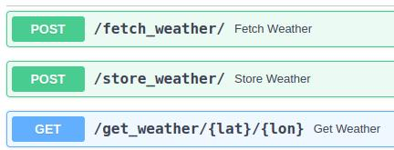
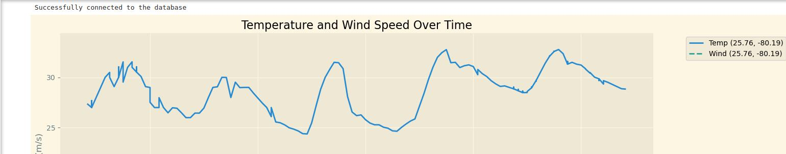

# Forecast Data Analysis

**Forecast Data Analysis** is a comprehensive project that integrates weather data retrieval, storage, and visualization. It includes:

- **FastAPI**: A high-performance API for scraping weather data from the Tomorrow.io API and storing it in a PostgreSQL database.
- **PostgreSQL**: A containerized database for storing weather data.
- **Jupyter Notebook**: A containerized environment for visualizing the stored weather data with interactive diagrams.

## Setup and Running

1. Clone this repository.
2. Install project requirements:
   ```bash
   pip install -r requirements.txt
   ```

3. Get a [Tomorrow.io](https://www.tomorrow.io/) API key and add to the `.env` file, or set it as `TOMORROW_IO_API_KEY` env variable, like:
`export TOMORROW_IO_API_KEY="your_api_key"`.
4. Review other required parameters in .env, such as: **DATABASE_URL** and **FORECAST_HOURS**
5. Build and start Docker containers:
   ```bash
   docker-compose up --build
## Accessing the Services
1. FastAPI: Access the API documentation and endpoints at http://127.0.0.1:8000/docs. Here you can explore the available API methods and their details.


2. Jupyter Notebook: Open http://127.0.0.1:8888 in your browser. Retrieve the security token from the Docker console during container startup.
3. Data Visualization: View the final visualizations generated from your data requests in the Jupyter Notebook.

## Testing
1. You might need to add the generated project root directory to the
[`PYTHONPATH`](https://docs.python.org/3/using/cmdline.html#envvar-PYTHONPATH) in some cases: `export PYTHONPATH="{$PYTHONPATH}:/absolute/path/to/project"`
2. Run `pytest tests/` (_not implemented yet_)


## Contributing

Before starting to contribute to this project, please install `pre-commit` to make
sure your changes get checked for style and standards before committing them to repository:

    $ pip install pre-commit

    $ pre-commit install
